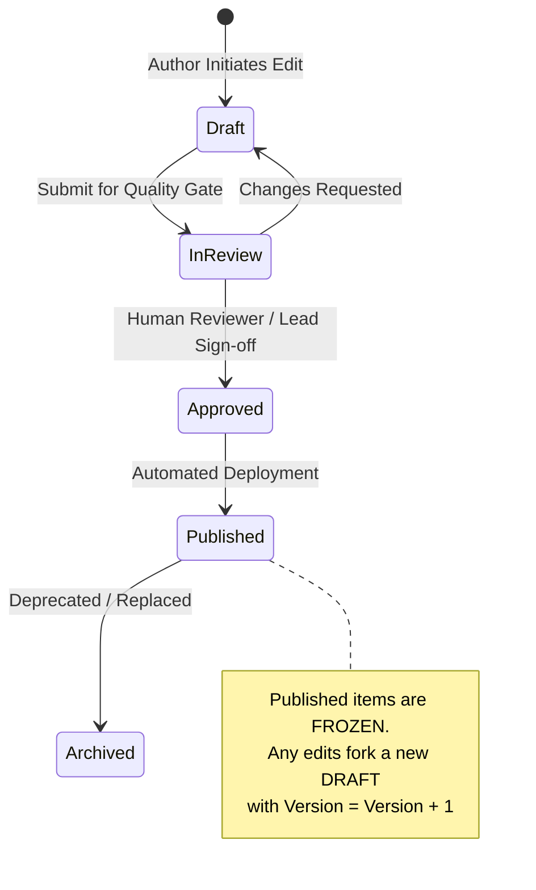

# YOUVA-EdAI: Knowledge Database & Learning Knowledge Cycle Specification
**Document Version:** 1.0.0  
**Status:** Canonical Platform Technical Contract  
**Author:** Multi-Disciplinary Architecture Group (Systems, Product, UI/UX, Framework, EdTech)  
**Target Systems:** PostgreSQL 16+, Prisma ORM, NestJS Modular Monolith, React/Next.js UI

---

## 1. Executive Summary & Architectural Invariants

The **Learning Knowledge Cycle** is the foundational platform subsystem of YOUVA-EdAI. It transforms the platform from a passive "content repository" into an active, adaptive, and self-improving educational intelligence engine.

```
          ┌───────────────┐
          │    CREATE     │ ◄──────────────────────────┐
          └───────┬───────┘                            │
                  ▼                                    │
          ┌───────────────┐                            │
          │    CURATE     │                            │
          └───────┬───────┘                            │
                  ▼                                    │
          ┌───────────────┐                            │
          │    PUBLISH    │                            │
          └───────┬───────┘                            │
                  ▼                                    │
          ┌───────────────┐                            │
          │    DELIVER    │                            │
          └───────┬───────┘                            │
                  ▼                                    │
          ┌───────────────┐                            │
          │    LEARN      │                            │
          └───────┬───────┘                            │
                  ▼                                    │
          ┌───────────────┐                            │
          │   PRACTICE    │                            │
          └───────┬───────┘                            │
                  ▼                                    │
          ┌───────────────┐                            │
          │    ASSESS     │                            │
          └───────┬───────┘                            │
                  ▼                                    │
          ┌───────────────┐                            │
          │    ANALYZE    │                            │
          └───────┬───────┘                            │
                  ▼                                    │
          ┌───────────────┐                            │
          │  PERSONALIZE  │                            │
          └───────┬───────┘                            │
                  ▼                                    │
          ┌───────────────┐                            │
          │    IMPROVE    │────────────────────────────┘
          └───────────────┘
```

### 1.1 Non-Negotiable Architectural Invariants

1. **Concept $\neq$ Lesson $\neq$ Question**: 
   - A **Concept** is an ontological unit of human knowledge (e.g., *Linear Equations with One Variable*).
   - A **Lesson** is a pedagogical sequence created to instruct a learner on one or more concepts.
   - A **Question** is an evaluative instrument designed to probe mastery of a specific concept or learning objective.
2. **Layer A (Canonical Knowledge) is Decoupled from Layer B (Learning State)**:
   - Layer A models what knowledge *is* (curriculum, topics, concepts, items, relationships). It is immutable per version.
   - Layer B models what a learner *has done* (attempts, latency, mastery vectors, misconceptions).
   - Layer A objects never contain learner IDs, completion counters, or student mutable state.
3. **Immutable Content Versioning**:
   - Published knowledge objects are immutable. Any update yields a new semantic version ($v+1$) or revision.
   - Student learning sessions pin the exact version completed to guarantee auditability and historical integrity.
4. **AI Sits Around the Knowledge Graph, Never Replaces It**:
   - AI generates drafts, suggests relationships, formulates hints, and differentiates explanations.
   - AI content requires human teacher approval or quality-gate verification before transitioning to `PUBLISHED`.
   - AI cannot unilaterally certify mastery or bypass prerequisite gates.
5. **Relationship-First Knowledge Architecture**:
   - Educational objects are stored as vertices in a directed knowledge graph with explicit semantic edges (`PREREQUISITE_FOR`, `REMEDIATED_BY`, `BUILDS_ON`, `ASSESSED_BY`).

---

## 2. Knowledge Hierarchy & Object Classification

The platform structures human knowledge into a strict 7-level taxonomy:

```
Level 1: Curriculum             (e.g., CBSE Class 8, Cambridge IGCSE, US Common Core)
   │
Level 2: Subject                (e.g., Mathematics, Physical Sciences, Humanities)
   │
Level 3: Course                 (e.g., Grade 8 Mathematics - Term 1)
   │
Level 4: Module / Unit          (e.g., Unit 3: Algebraic Expressions & Linear Equations)
   │
Level 5: Topic                  (e.g., Topic 3.2: Solving Linear Equations)
   │
Level 6: Concept                (e.g., Concept: Transposition Method in Linear Equations)
   │
Level 7: Learning Object (LO)   (Atomic pedagogical artifact)
```

### 2.1 Learning Object (LO) Taxonomy

Each Learning Object belongs to an explicit pedagogical subtype:

| LO Subtype | Pedagogical Role | Bloom's Taxonomy Alignment | Format / Modality |
| :--- | :--- | :--- | :--- |
| `EXPLANATION` | Core conceptual exposition | Remember / Understand | Text, Markdown, KaTeX, Audio |
| `DEFINITION` | Formal terminology and notation | Remember | Structured Glossary Item |
| `EXAMPLE` | Illustrative scenario | Understand / Apply | Real-world Context, Narrative |
| `WORKED_EXAMPLE`| Step-by-step problem breakdown | Apply / Analyze | Step-by-Step Annotated Solution |
| `DIAGRAM` | Visual mental model | Understand / Analyze | SVG, Mermaid, Interactive Canvas |
| `VIDEO_REF` | Timestamped multimedia reference | Understand | Curated/Sanitized Video Stream |
| `ACTIVITY` | Formative, interactive engagement | Apply | Drag-and-Drop, Sim, Matching |
| `PRACTICE_Q` | Low-stakes deliberate practice | Apply / Analyze | QTI 3.0 Standard Item |
| `ASSESSMENT_Q`| High-stakes summative item | Analyze / Evaluate | Evaluated Question with Rubric |
| `MISCONCEPTION`| Explicit cognitive pitfall | Understand / Analyze | Buggy Algorithm / Distractor Explanation |
| `HINT` | Scaffolding for deliberate practice| Apply | Tiered Socratic Prompt (Level 1, 2, 3) |
| `REMEDIATION` | Target path when mastery fails | Understand / Apply | Simplified Concept / Analogous Model |
| `EXTENSION` | Depth/enrichment for advanced learners | Evaluate / Create | Olympiad/Real-world Challenge |

---

## 3. Complete Database Schema (Prisma DDL)

The data model is partitioned into five distinct domain schemas within PostgreSQL:
1. **Knowledge Domain** (Canonical taxonomy & graph)
2. **Content Domain** (Lessons, questions, rubrics, assets)
3. **Authoring Domain** (Drafts, reviews, version trees, audit)
4. **Learner Domain** (Mastery vectors, attempts, sessions)
5. **Analytics Domain** (Telemetry, cohort aggregations, item discrimination)

```prisma
// ============================================================================
// YOUVA-EdAI: Canonical Knowledge & Learning Cycle Schema
// ============================================================================

generator client {
  provider        = "prisma-client-js"
  previewFeatures = ["fullTextSearch", "postgresqlExtensions"]
}

datasource db {
  provider   = "postgresql"
  url        = env("DATABASE_URL")
  extensions = [pgcrypto, vector]
}

// ----------------------------------------------------------------------------
// DOMAIN 1: KNOWLEDGE TAXONOMY & GRAPH
// ----------------------------------------------------------------------------

enum KnowledgeLevel {
  EARLY_CHILDHOOD
  PRIMARY
  MIDDLE_SCHOOL
  SECONDARY
  SENIOR_SECONDARY
  HIGHER_ED
  VOCATIONAL
}

enum EdgeType {
  PREREQUISITE_FOR   // A must be mastered before B
  BUILDS_ON          // B expands upon A without strict blocking
  RELATED_TO         // Lateral conceptual connection
  PART_OF            // Hierarchical composition
  CONTRASTS_WITH     // Concepts often confused or compared
  EXAMPLE_OF         // Concrete instantiation of abstract concept
  ASSESSED_BY        // Concept verified by Question/Assessment
  REMEDIATED_BY      // Target LO for failed mastery
  EXTENDS_TO         // Advanced extension trajectory
}

enum PublicationStatus {
  DRAFT
  IN_REVIEW
  AI_PROPOSED
  APPROVED
  PUBLISHED
  ARCHIVED
  DEPRECATED
}

model Curriculum {
  id          String         @id @default(dbgenerated("gen_random_uuid()")) @db.Uuid
  code        String         @unique // e.g., "CBSE-MATH-2026", "CAMBRIDGE-0580"
  name        String
  country     String         @default("GLOBAL")
  level       KnowledgeLevel
  description String?
  metadata    Json           @default("{}")
  createdAt   DateTime       @default(now())
  updatedAt   DateTime       @updatedAt

  subjects    Subject[]

  @@index([code, level])
}

model Subject {
  id           String      @id @default(dbgenerated("gen_random_uuid()")) @db.Uuid
  curriculumId String      @db.Uuid
  curriculum   Curriculum  @relation(fields: [curriculumId], references: [id], onDelete: Cascade)
  code         String      // e.g., "MATH-G8"
  name         String      // e.g., "Mathematics Grade 8"
  iconUrl      String?
  description  String?
  createdAt    DateTime    @default(now())
  updatedAt    DateTime    @updatedAt

  courses      Course[]

  @@unique([curriculumId, code])
  @@index([curriculumId])
}

model Course {
  id          String   @id @default(dbgenerated("gen_random_uuid()")) @db.Uuid
  subjectId   String   @db.Uuid
  subject     Subject  @relation(fields: [subjectId], references: [id], onDelete: Cascade)
  code        String   // e.g., "ALG-G8-T1"
  title       String
  description String?
  orderIndex  Int      @default(0)
  createdAt   DateTime @default(now())
  updatedAt   DateTime @updatedAt

  units       Unit[]

  @@unique([subjectId, code])
  @@index([subjectId, orderIndex])
}

model Unit {
  id          String   @id @default(dbgenerated("gen_random_uuid()")) @db.Uuid
  courseId    String   @db.Uuid
  course      Course   @relation(fields: [courseId], references: [id], onDelete: Cascade)
  code        String   // e.g., "UNIT-03"
  title       String   // e.g., "Linear Equations in One Variable"
  description String?
  orderIndex  Int      @default(0)
  createdAt   DateTime @default(now())
  updatedAt   DateTime @updatedAt

  topics      Topic[]

  @@unique([courseId, code])
  @@index([courseId, orderIndex])
}

model Topic {
  id          String   @id @default(dbgenerated("gen_random_uuid()")) @db.Uuid
  unitId      String   @db.Uuid
  unit        Unit     @relation(fields: [unitId], references: [id], onDelete: Cascade)
  code        String   // e.g., "TOPIC-03-02"
  title       String   // e.g., "Solving Equations with Variables on Both Sides"
  description String?
  orderIndex  Int      @default(0)
  createdAt   DateTime @default(now())
  updatedAt   DateTime @updatedAt

  concepts    Concept[]
  lessons     Lesson[]

  @@unique([unitId, code])
  @@index([unitId, orderIndex])
}

model Concept {
  id                 String            @id @default(dbgenerated("gen_random_uuid()")) @db.Uuid
  topicId            String            @db.Uuid
  topic              Topic             @relation(fields: [topicId], references: [id], onDelete: Cascade)
  canonicalCode      String            @unique // e.g., "concept.math.linear-eq.transposition"
  currentVersion     Int               @default(1)
  status             PublicationStatus @default(DRAFT)
  
  // Content snapshot for current published version
  title              String
  slug               String            @unique
  description        String
  difficultyScore    Decimal           @default(0.50) @db.Decimal(3, 2) // 0.00 to 1.00
  estimatedMinutes   Int               @default(15)
  keywords           String[]          @default([])
  learningObjectives String[]          @default([])
  metadata           Json              @default("{}")

  createdAt          DateTime          @default(now())
  updatedAt          DateTime          @updatedAt

  // Graph Edges
  outgoingEdges      KnowledgeEdge[]   @relation("OutgoingEdges")
  incomingEdges      KnowledgeEdge[]   @relation("IncomingEdges")

  // Child Artifacts
  versions           ConceptVersion[]
  learningObjects    LearningObject[]
  questions          Question[]
  misconceptions     Misconception[]

  // Learner State (Decoupled Relational Link)
  learnerMastery     LearnerConceptMastery[]

  @@index([topicId])
  @@index([canonicalCode, status])
  @@index([difficultyScore])
}

model KnowledgeEdge {
  id             String    @id @default(dbgenerated("gen_random_uuid()")) @db.Uuid
  sourceConceptId String   @db.Uuid
  sourceConcept  Concept   @relation("OutgoingEdges", fields: [sourceConceptId], references: [id], onDelete: Cascade)
  targetConceptId String   @db.Uuid
  targetConcept  Concept   @relation("IncomingEdges", fields: [targetConceptId], references: [id], onDelete: Cascade)
  edgeType       EdgeType
  weight         Decimal   @default(1.00) @db.Decimal(3, 2) // Strength/criticality
  isStrictGate   Boolean   @default(false) // If true, strict blocking prerequisite
  rationale      String?   // Pedagogical justification for relation
  metadata       Json      @default("{}")
  createdAt      DateTime  @default(now())
  updatedAt      DateTime  @updatedAt

  @@unique([sourceConceptId, targetConceptId, edgeType])
  @@index([sourceConceptId, edgeType])
  @@index([targetConceptId, edgeType])
}

// ----------------------------------------------------------------------------
// DOMAIN 2: CONTENT & PEDAGOGICAL ARTIFACTS
// ----------------------------------------------------------------------------

enum LearningObjectType {
  EXPLANATION
  DEFINITION
  EXAMPLE
  WORKED_EXAMPLE
  DIAGRAM
  VIDEO_REF
  ACTIVITY
  READING
  EXERCISE
  REVISION_NOTE
  REMEDIATION
  EXTENSION
}

enum QuestionType {
  MULTIPLE_CHOICE
  MULTIPLE_RESPONSE
  FILL_IN_BLANK
  NUMERIC_EXACT
  NUMERIC_TOLERANCE
  ORDERING
  DRAG_DROP
  MATCHING
  SHORT_TEXT
  FREE_EXPLANATION
}

model LearningObject {
  id                 String             @id @default(dbgenerated("gen_random_uuid()")) @db.Uuid
  conceptId          String             @db.Uuid
  concept            Concept            @relation(fields: [conceptId], references: [id], onDelete: Cascade)
  type               LearningObjectType
  version            Int                @default(1)
  status             PublicationStatus  @default(DRAFT)
  title              String
  contentPayload     Json               // Rich text, KaTeX AST, interactive config
  mediaUrls          String[]           @default([])
  cognitiveLevel     String             @default("APPLY") // Bloom's level
  targetPedagogy     String?            // e.g., "Socratic", "Direct Instruction", "Inquiry"
  accessibilityData  Json               @default("{}") // Screen-reader transcripts, alt-texts
  metadata           Json               @default("{}")
  createdAt          DateTime           @default(now())
  updatedAt          DateTime           @updatedAt

  lessonSections     LessonSection[]
  versions           LearningObjectVersion[]

  @@index([conceptId, type, status])
}

model Question {
  id                String            @id @default(dbgenerated("gen_random_uuid()")) @db.Uuid
  conceptId         String            @db.Uuid
  concept           Concept           @relation(fields: [conceptId], references: [id], onDelete: Cascade)
  canonicalCode     String            @unique // e.g., "Q-MATH-LINEQ-104"
  type              QuestionType
  version           Int               @default(1)
  status            PublicationStatus @default(DRAFT)
  difficultyScore   Decimal           @default(0.50) @db.Decimal(3, 2)
  discriminationIdx Decimal           @default(0.30) @db.Decimal(3, 2) // Item Discrimination Index (IRT)
  prompt            Json              // Markdown + KaTeX + Assets
  stimulus          Json?             // Context / Passage / Code snippet
  interactionConfig Json              // Choices, validation rules, tolerances
  correctAnswer     Json              // Strict ground truth representation
  rubric            Json?             // Analytical scoring rubric for subjective items
  explanation       Json?             // Post-submission pedagogical solution
  hints             QuestionHint[]
  targetedMisconceptions QuestionMisconception[]

  createdAt         DateTime          @default(now())
  updatedAt         DateTime          @updatedAt

  lessonSections    LessonSection[]
  studentResponses  StudentItemResponse[]

  @@index([conceptId, status])
  @@index([difficultyScore])
}

model QuestionHint {
  id           String   @id @default(dbgenerated("gen_random_uuid()")) @db.Uuid
  questionId   String   @db.Uuid
  question     Question @relation(fields: [questionId], references: [id], onDelete: Cascade)
  tier         Int      @default(1) // Tier 1 (Nudge), Tier 2 (Structural), Tier 3 (Bottom-Out)
  content      Json     // Markdown / KaTeX
  penaltyRatio Decimal  @default(0.10) @db.Decimal(3, 2) // Score reduction for using hint
  createdAt    DateTime @default(now())

  @@unique([questionId, tier])
  @@index([questionId])
}

model Misconception {
  id               String                  @id @default(dbgenerated("gen_random_uuid()")) @db.Uuid
  conceptId        String                  @db.Uuid
  concept          Concept                 @relation(fields: [conceptId], references: [id], onDelete: Cascade)
  code             String                  // e.g., "MISCON-SIGN-FLIP"
  title            String                  // e.g., "Failure to invert sign during transposition"
  diagnosisPattern String                  // Regex, AST rule, or semantic trigger
  remediationPlan  Json                    // Targeted prompt / mini-lesson
  createdAt        DateTime                @default(now())
  updatedAt        DateTime                @updatedAt

  targetedByQuestions QuestionMisconception[]
  detectedInstances   StudentDetectedMisconception[]

  @@unique([conceptId, code])
  @@index([conceptId])
}

model QuestionMisconception {
  questionId      String        @db.Uuid
  question        Question      @relation(fields: [questionId], references: [id], onDelete: Cascade)
  misconceptionId String        @db.Uuid
  misconception   Misconception @relation(fields: [misconceptionId], references: [id], onDelete: Cascade)
  distractorKey   String        // e.g., "option_B" or numeric boundary

  @@id([questionId, misconceptionId, distractorKey])
}

model Lesson {
  id          String            @id @default(dbgenerated("gen_random_uuid()")) @db.Uuid
  topicId     String            @db.Uuid
  topic       Topic             @relation(fields: [topicId], references: [id], onDelete: Cascade)
  slug        String            @unique
  title       String
  summary     String?
  version     Int               @default(1)
  status      PublicationStatus @default(DRAFT)
  durationMin Int               @default(30)
  metadata    Json              @default("{}")
  createdAt   DateTime          @default(now())
  updatedAt   DateTime          @updatedAt

  sections    LessonSection[]
  versions    LessonVersion[]

  @@index([topicId, status])
}

model LessonSection {
  id               String          @id @default(dbgenerated("gen_random_uuid()")) @db.Uuid
  lessonId         String          @db.Uuid
  lesson           Lesson          @relation(fields: [lessonId], references: [id], onDelete: Cascade)
  orderIndex       Int             @default(0)
  title            String
  sectionType      String          // "INTRO", "EXPOSITION", "GUIDED_PRACTICE", "ASSESSMENT"
  
  learningObjectId String?         @db.Uuid
  learningObject   LearningObject? @relation(fields: [learningObjectId], references: [id], onDelete: SetNull)
  
  questionId       String?         @db.Uuid
  question         Question?       @relation(fields: [questionId], references: [id], onDelete: SetNull)

  customContent    Json?           // Optional inline markdown/overrides
  createdAt        DateTime        @default(now())
  updatedAt        DateTime        @updatedAt

  @@index([lessonId, orderIndex])
}

// ----------------------------------------------------------------------------
// DOMAIN 3: AUTHORING, VERSIONING & GOVERNANCE
// ----------------------------------------------------------------------------

enum ReviewOutcome {
  APPROVED
  REQUEST_CHANGES
  REJECTED
}

model ConceptVersion {
  id          String            @id @default(dbgenerated("gen_random_uuid()")) @db.Uuid
  conceptId   String            @db.Uuid
  concept     Concept           @relation(fields: [conceptId], references: [id], onDelete: Cascade)
  version     Int
  snapshot    Json              // Full snapshot of fields, objectives, keywords
  authorId    String            @db.Uuid
  status      PublicationStatus
  changelog   String?
  createdAt   DateTime          @default(now())

  reviews     ContentReview[]

  @@unique([conceptId, version])
  @@index([conceptId, status])
}

model LearningObjectVersion {
  id               String            @id @default(dbgenerated("gen_random_uuid()")) @db.Uuid
  learningObjectId String            @db.Uuid
  learningObject   LearningObject    @relation(fields: [learningObjectId], references: [id], onDelete: Cascade)
  version          Int
  snapshot         Json              // Content payload + metadata
  authorId         String            @db.Uuid
  status           PublicationStatus
  changelog        String?
  createdAt        DateTime          @default(now())

  reviews          ContentReview[]

  @@unique([learningObjectId, version])
}

model LessonVersion {
  id        String            @id @default(dbgenerated("gen_random_uuid()")) @db.Uuid
  lessonId  String            @db.Uuid
  lesson    Lesson            @relation(fields: [lessonId], references: [id], onDelete: Cascade)
  version   Int
  snapshot  Json              // Entire section hierarchy + references
  authorId  String            @db.Uuid
  status    PublicationStatus
  changelog String?
  createdAt DateTime          @default(now())

  reviews   ContentReview[]

  @@unique([lessonId, version])
}

model ContentReview {
  id                      String                 @id @default(dbgenerated("gen_random_uuid()")) @db.Uuid
  conceptVersionId        String?                @db.Uuid
  conceptVersion          ConceptVersion?        @relation(fields: [conceptVersionId], references: [id], onDelete: Cascade)
  learningObjectVersionId String?                @db.Uuid
  learningObjectVersion   LearningObjectVersion? @relation(fields: [learningObjectVersionId], references: [id], onDelete: Cascade)
  lessonVersionId         String?                @db.Uuid
  lessonVersion           LessonVersion?         @relation(fields: [lessonVersionId], references: [id], onDelete: Cascade)
  
  reviewerId              String                 @db.Uuid
  reviewerRole            String                 // "TEACHER_PEER", "CONTENT_LEAD", "CURRICULUM_ADMIN"
  outcome                 ReviewOutcome
  feedbackNotes           String
  automatedLinterReport   Json?                  // Spelling, readability, rubric adherence
  createdAt               DateTime               @default(now())

  @@index([reviewerId, outcome])
}

// ----------------------------------------------------------------------------
// DOMAIN 4: LEARNER STATE & ADAPTIVE MODEL (LAYER B)
// ----------------------------------------------------------------------------

enum MasteryBand {
  NOVICE        // 0.00 - 0.39
  DEVELOPING    // 0.40 - 0.69
  PROFICIENT    // 0.70 - 0.89
  MASTERED      // 0.90 - 1.00
}

model LearnerConceptMastery {
  id                   String      @id @default(dbgenerated("gen_random_uuid()")) @db.Uuid
  learnerId            String      @db.Uuid
  conceptId            String      @db.Uuid
  concept              Concept     @relation(fields: [conceptId], references: [id], onDelete: Cascade)
  
  // Bayesian Knowledge Tracing (BKT) / DKT State
  pMastery             Decimal     @default(0.10) @db.Decimal(4, 3) // 0.000 to 1.000
  pTransit             Decimal     @default(0.15) @db.Decimal(4, 3)
  pSlip                Decimal     @default(0.10) @db.Decimal(4, 3)
  pGuess               Decimal     @default(0.20) @db.Decimal(4, 3)
  
  masteryBand          MasteryBand @default(NOVICE)
  consecutiveCorrect   Int         @default(0)
  totalAttempts        Int         @default(0)
  lastPracticedAt      DateTime?
  nextScheduledReview  DateTime?   // Spaced Repetition (SM-2 / FSRS)
  stabilityIndex       Decimal     @default(1.0) @db.Decimal(5, 2)
  difficultyFactor     Decimal     @default(2.5) @db.Decimal(4, 2)

  createdAt            DateTime    @default(now())
  updatedAt            DateTime    @updatedAt

  @@unique([learnerId, conceptId])
  @@index([learnerId, masteryBand])
  @@index([conceptId, masteryBand])
}

model StudentItemResponse {
  id               String       @id @default(dbgenerated("gen_random_uuid()")) @db.Uuid
  learnerId        String       @db.Uuid
  questionId       String       @db.Uuid
  question         Question     @relation(fields: [questionId], references: [id], onDelete: Cascade)
  questionVersion  Int          // Immutable reference to question version attempted
  sessionId        String       @db.Uuid
  
  submittedAnswer  Json
  isCorrect        Boolean
  rawScore         Decimal      @db.Decimal(4, 2)
  maxScore         Decimal      @db.Decimal(4, 2)
  latencyMs        Int          // Response time in ms
  hintsRequested   Int          @default(0)
  evaluatedBy      String       // "DETERMINISTIC_MATCHER", "AI_RUBRIC_EVALUATOR", "TEACHER"
  evaluationReport Json?
  createdAt        DateTime     @default(now())

  misconceptions   StudentDetectedMisconception[]

  @@index([learnerId, questionId])
  @@index([sessionId])
  @@index([isCorrect])
}

model StudentDetectedMisconception {
  id              String              @id @default(dbgenerated("gen_random_uuid()")) @db.Uuid
  learnerId       String              @db.Uuid
  itemResponseId  String              @db.Uuid
  itemResponse    StudentItemResponse @relation(fields: [itemResponseId], references: [id], onDelete: Cascade)
  misconceptionId String              @db.Uuid
  misconception   Misconception       @relation(fields: [misconceptionId], references: [id], onDelete: Cascade)
  confidenceScore Decimal             @default(1.00) @db.Decimal(3, 2)
  detectedAt      DateTime            @default(now())

  @@index([learnerId, misconceptionId])
}

// ----------------------------------------------------------------------------
// DOMAIN 5: ANALYTICS & TELEMETRY
// ----------------------------------------------------------------------------

model LearningTelemetryEvent {
  id             String   @id @default(dbgenerated("gen_random_uuid()")) @db.Uuid
  idempotencyKey String   @unique
  learnerId      String   @db.Uuid
  sessionId      String   @db.Uuid
  eventType      String   // "LO_VIEWED", "VIDEO_PAUSED", "STEP_EXPANDED", "SIM_INTERACTION"
  targetEntity   String   // "CONCEPT", "LEARNING_OBJECT", "QUESTION"
  targetEntityId String   @db.Uuid
  payload        Json     @default("{}")
  clientTimestamp DateTime
  serverTimestamp DateTime @default(now())

  @@index([learnerId, eventType])
  @@index([targetEntityId, eventType])
  @@index([serverTimestamp])
}

model ConceptCohortAnalytics {
  id                 String   @id @default(dbgenerated("gen_random_uuid()")) @db.Uuid
  conceptId          String   @db.Uuid
  cohortId           String   @db.Uuid // Class, School, or Global Cohort
  totalLearners      Int
  noviceCount        Int
  developingCount    Int
  proficientCount    Int
  masteredCount      Int
  averageLatencySec  Int
  commonMisconceptionIds String[]
  aggregatedAt       DateTime @default(now())

  @@unique([conceptId, cohortId])
  @@index([conceptId])
}
```

---

## 4. Entity-by-Entity Definitions & Primary/Foreign Keys

### 4.1 Knowledge Domain Entities

| Entity | Primary Key | Foreign Keys | Key Invariant / Constraint |
| :--- | :--- | :--- | :--- |
| `Curriculum` | `id` (UUIDv4) | None | Unique `code`. Root of curriculum hierarchy. |
| `Subject` | `id` (UUIDv4) | `curriculumId` $\to$ `Curriculum.id` | Unique `(curriculumId, code)`. |
| `Course` | `id` (UUIDv4) | `subjectId` $\to$ `Subject.id` | Unique `(subjectId, code)`. Explicit `orderIndex`. |
| `Unit` | `id` (UUIDv4) | `courseId` $\to$ `Course.id` | Unique `(courseId, code)`. Logical module boundary. |
| `Topic` | `id` (UUIDv4) | `unitId` $\to$ `Unit.id` | Unique `(unitId, code)`. |
| `Concept` | `id` (UUIDv4) | `topicId` $\to$ `Topic.id` | Unique `canonicalCode` and `slug`. Canonical knowledge node. |
| `KnowledgeEdge` | `id` (UUIDv4) | `sourceConceptId`, `targetConceptId` $\to$ `Concept.id` | Directed graph edge. Unique `(sourceConceptId, targetConceptId, edgeType)`. Prohibits self-loops. |

### 4.2 Content Domain Entities

| Entity | Primary Key | Foreign Keys | Key Invariant / Constraint |
| :--- | :--- | :--- | :--- |
| `LearningObject` | `id` (UUIDv4) | `conceptId` $\to$ `Concept.id` | Atomic content block typed by `LearningObjectType`. Versioned. |
| `Question` | `id` (UUIDv4) | `conceptId` $\to$ `Concept.id` | Unique `canonicalCode`. Adheres to QTI 3.0 schema. Item response theory (IRT) metric tracking. |
| `QuestionHint` | `id` (UUIDv4) | `questionId` $\to$ `Question.id` | Unique `(questionId, tier)`. Scaffolding progression. |
| `Misconception`| `id` (UUIDv4) | `conceptId` $\to$ `Concept.id` | Unique `(conceptId, code)`. Diagnoses persistent cognitive errors. |
| `Lesson` | `id` (UUIDv4) | `topicId` $\to$ `Topic.id` | Unique `slug`. Pedagogical sequence container. |
| `LessonSection` | `id` (UUIDv4) | `lessonId` $\to$ `Lesson.id`, optional `LO.id`, `Question.id` | Polymorphic section container with strict ordering. |

### 4.3 Authoring & Learner Domain Entities

| Entity | Primary Key | Foreign Keys | Key Invariant / Constraint |
| :--- | :--- | :--- | :--- |
| `ConceptVersion` | `id` (UUIDv4) | `conceptId` $\to$ `Concept.id` | Immutable snapshot of published state. Unique `(conceptId, version)`. |
| `ContentReview` | `id` (UUIDv4) | Polymorphic FKs to `Version.id` | Audit-trailed human/AI review gate before publication. |
| `LearnerConceptMastery` | `id` (UUIDv4) | `conceptId` $\to$ `Concept.id` | Unique `(learnerId, conceptId)`. Decoupled Layer B mastery vector. |
| `StudentItemResponse` | `id` (UUIDv4) | `questionId` $\to$ `Question.id` | Immutable evaluative evidence log. Captures response latency and hint usage. |
| `LearningTelemetryEvent` | `id` (UUIDv4) | `targetEntityId` | Append-only telemetry event log with unique `idempotencyKey`. |

---

## 5. Knowledge-Object Schema (JSON Schema & TypeScript)

Every knowledge object exchanged over APIs or persisted in version snapshots strictly complies with the following schemas.

### 5.1 TypeScript Type Definitions

```typescript
// domain/knowledge/types.ts

export type EdgeType =
  | 'PREREQUISITE_FOR'
  | 'BUILDS_ON'
  | 'RELATED_TO'
  | 'PART_OF'
  | 'CONTRASTS_WITH'
  | 'EXAMPLE_OF'
  | 'ASSESSED_BY'
  | 'REMEDIATED_BY'
  | 'EXTENDS_TO';

export type PublicationStatus =
  | 'DRAFT'
  | 'IN_REVIEW'
  | 'AI_PROPOSED'
  | 'APPROVED'
  | 'PUBLISHED'
  | 'ARCHIVED'
  | 'DEPRECATED';

export type LearningObjectSubtype =
  | 'EXPLANATION'
  | 'DEFINITION'
  | 'EXAMPLE'
  | 'WORKED_EXAMPLE'
  | 'DIAGRAM'
  | 'VIDEO_REF'
  | 'ACTIVITY'
  | 'READING'
  | 'EXERCISE'
  | 'REVISION_NOTE'
  | 'REMEDIATION'
  | 'EXTENSION';

export interface ConceptEntity {
  id: string;
  canonicalCode: string;
  topicId: string;
  title: string;
  slug: string;
  description: string;
  difficultyScore: number; // 0.00 to 1.00
  estimatedMinutes: number;
  keywords: string[];
  learningObjectives: string[];
  prerequisites: Array<{
    conceptId: string;
    canonicalCode: string;
    isStrictGate: boolean;
    weight: number;
  }>;
  relatedConcepts: Array<{
    conceptId: string;
    edgeType: EdgeType;
  }>;
  learningObjects: LearningObjectRef[];
  questionCodes: string[];
  misconceptionCodes: string[];
  version: number;
  status: PublicationStatus;
  metadata: Record<string, unknown>;
}

export interface LearningObjectRef {
  id: string;
  type: LearningObjectSubtype;
  title: string;
  cognitiveLevel: 'REMEMBER' | 'UNDERSTAND' | 'APPLY' | 'ANALYZE' | 'EVALUATE' | 'CREATE';
  version: number;
}

export interface QuestionEntity {
  id: string;
  canonicalCode: string;
  conceptId: string;
  type: 'MULTIPLE_CHOICE' | 'FILL_IN_BLANK' | 'NUMERIC_TOLERANCE' | 'MATCHING' | 'ORDERING';
  prompt: {
    markdown: string;
    katexSnippets?: string[];
    mediaAssets?: Array<{ type: 'IMAGE' | 'AUDIO'; url: string; alt: string }>;
  };
  stimulus?: {
    contextMarkdown: string;
  };
  interactionConfig: {
    options?: Array<{ key: string; text: string; assets?: string[] }>;
    allowMultiple?: boolean;
    toleranceRange?: { min: number; max: number };
  };
  correctAnswer: {
    targetKeys?: string[];
    numericValue?: number;
    orderedKeys?: string[];
  };
  hints: Array<{
    tier: 1 | 2 | 3;
    content: string;
    penaltyRatio: number;
  }>;
  targetedMisconceptions: Array<{
    misconceptionCode: string;
    distractorKey: string;
  }>;
  difficultyScore: number;
  discriminationIdx: number;
  version: number;
  status: PublicationStatus;
}
```

### 5.2 Canonical Concept JSON Schema (Draft 2020-12)

```json
{
  "$schema": "https://json-schema.org/draft/2020-12/schema",
  "$id": "https://youva-edai.org/schemas/concept.json",
  "title": "YouvaConcept",
  "type": "object",
  "required": [
    "canonicalCode",
    "topicId",
    "title",
    "slug",
    "description",
    "difficultyScore",
    "learningObjectives",
    "status",
    "version"
  ],
  "properties": {
    "id": { "type": "string", "format": "uuid" },
    "canonicalCode": {
      "type": "string",
      "pattern": "^concept\\.[a-z0-9\\-]+(\\.[a-z0-9\\-]+)+$"
    },
    "topicId": { "type": "string", "format": "uuid" },
    "title": { "type": "string", "minLength": 3, "maxLength": 200 },
    "slug": { "type": "string", "pattern": "^[a-z0-9]+(?:-[a-z0-9]+)*$" },
    "description": { "type": "string", "minLength": 10 },
    "difficultyScore": { "type": "number", "minimum": 0.0, "maximum": 1.0 },
    "estimatedMinutes": { "type": "integer", "minimum": 1, "maximum": 300 },
    "keywords": {
      "type": "array",
      "items": { "type": "string" },
      "uniqueItems": true
    },
    "learningObjectives": {
      "type": "array",
      "items": { "type": "string", "minLength": 5 },
      "minItems": 1
    },
    "prerequisites": {
      "type": "array",
      "items": {
        "type": "object",
        "required": ["conceptId", "isStrictGate"],
        "properties": {
          "conceptId": { "type": "string", "format": "uuid" },
          "isStrictGate": { "type": "boolean" },
          "weight": { "type": "number", "minimum": 0.0, "maximum": 1.0 }
        }
      }
    },
    "status": {
      "type": "string",
      "enum": ["DRAFT", "IN_REVIEW", "AI_PROPOSED", "APPROVED", "PUBLISHED", "ARCHIVED"]
    },
    "version": { "type": "integer", "minimum": 1 },
    "metadata": { "type": "object" }
  },
  "additionalProperties": false
}
```

---

## 6. Two-Layer Architecture: Canonical Knowledge vs. Learning State

The platform strictly enforces the architectural boundary between **Layer A** (Canonical Knowledge) and **Layer B** (Learning State).

```
┌─────────────────────────────────────────────────────────────────────────────┐
│ LAYER A: CANONICAL KNOWLEDGE (System-wide, Authored, Versioned, Immutable)  │
│                                                                             │
│  [Curriculum] ──► [Subject] ──► [Course] ──► [Unit] ──► [Topic]            │
│                                                            │                │
│                                                            ▼                │
│                                                       [Concept]             │
│                                                     ┌─────┴─────┐           │
│                                                     ▼           ▼           │
│                                              [LearningObject] [Question]    │
└──────────────────────────────────────┬──────────────────────────────────────┘
                                       │ References via Immutable IDs & Versions
                                       ▼
┌─────────────────────────────────────────────────────────────────────────────┐
│ LAYER B: LEARNER STATE (Per-Student, Ephemeral & Historical, Mutable State) │
│                                                                             │
│   Student 123 ──► [LearnerConceptMastery] (pMastery = 0.82, BKT Vectors)    │
│               ──► [StudentItemResponse]   (Question Q-104 v2: INCORRECT)    │
│               ──► [DetectedMisconception] (MISCON-SIGN-FLIP, conf = 0.95)   │
│               ──► [LearningTelemetry]     (LO_12 v1: Read 3m 42s)           │
└─────────────────────────────────────────────────────────────────────────────┘
```

### 6.1 Architectural Rules of Decoupling

1. **Zero Contamination**:
   - Layer A tables (`Concept`, `LearningObject`, `Question`, `Lesson`) MUST NOT have columns such as `lastAttemptedAt`, `viewCount`, `isCompleted`, or `learnerScore`.
2. **Version Pinning**:
   - When a student answers Question `Q-104`, Layer B writes a `StudentItemResponse` with `questionId` AND `questionVersion = 3`. If a teacher edits `Q-104` to version 4, the student's historical response and evaluation remains pinned to version 3.
3. **Scale Independent**:
   - 100,000 students reading Concept `Linear Equations` creates 100,000 Layer B mastery records. The single Layer A record is cached in Redis/CDN edge nodes without write locks.

---

## 7. Versioning, Revision & Historical Integrity Model

Content in YOUVA-EdAI follows **Append-Only Semantic Revisioning**.



### 7.1 Lifecycle Rules

1. **Active Publication Pointer**: The `Concept` table holds the current active version metadata for ultra-fast reading.
2. **Historical Snapshots**: The `ConceptVersion` table holds immutable JSON snapshots of every version ever published.
3. **Draft Workspaces**: When an author edits a published concept (e.g., $v3$), the system creates an authoring draft row with target version $v4$. The live version remains $v3$ until $v4$ is approved and published.
4. **Student Session Immutability**: If a student is midway through a lesson or quiz when a new version publishes, their active session remains bound to the version active when the session was created.

---

## 8. Publishing Workflow & State Machine

Every piece of content must traverse a deterministic state machine:

```
[DRAFT] 
   │
   ▼ (Submit for Review)
[IN_REVIEW] ◄───┐
   │            │ (AI Suggests Edits)
   ├────────────┼──► [AI_PROPOSED]
   │            │
   ▼ (Teacher/Admin Approves)
[APPROVED]
   │
   ▼ (Trigger Publishing Pipeline)
[PUBLISHED]
   │
   ▼ (Superceded by major curriculum overhaul)
[ARCHIVED]
```

### 8.1 State Transition Matrix & Permissions

| Initial State | Event / Trigger | Target State | Actor Permitted | Guard Condition |
| :--- | :--- | :--- | :--- | :--- |
| `DRAFT` | `SUBMIT_REVIEW` | `IN_REVIEW` | `AUTHOR`, `TEACHER` | All required fields valid; $\ge 1$ learning objective. |
| `DRAFT` | `REQUEST_AI_ENRICH` | `AI_PROPOSED` | `AUTHOR`, `TEACHER` | Content passed safety linter. |
| `AI_PROPOSED`| `ACCEPT_AI_EDITS` | `DRAFT` | `AUTHOR`, `TEACHER` | Teacher manually accepts/edits generated text. |
| `IN_REVIEW` | `REQUEST_CHANGES`| `DRAFT` | `REVIEWER`, `CONTENT_LEAD` | Feedback notes provided. |
| `IN_REVIEW` | `APPROVE` | `APPROVED` | `REVIEWER`, `CONTENT_LEAD` | Linter passed: no orphan links, KaTeX valid. |
| `APPROVED` | `PUBLISH` | `PUBLISHED` | `SYSTEM`, `ADMIN` | Atomically updates active pointer and freezes version. |
| `PUBLISHED`| `CREATE_REVISION`| `DRAFT` ($v+1$) | `AUTHOR`, `TEACHER` | Prior published version remains active. |
| `PUBLISHED`| `DEPRECATE` | `ARCHIVED` | `ADMIN`, `CURRICULUM_LEAD` | No active mandatory assignments depend on it. |

---

## 9. Role-Based Access Control (RBAC) & Multi-Tenant Scoping

### 9.1 RBAC Matrix

| Role | Knowledge (Read) | Knowledge (Author) | Content Review | Learner State (Self) | Class Analytics | System Admin |
| :--- | :--- :--- | :--- | :--- | :--- | :--- | :--- |
| **Student** | Published Only | No | No | Read/Write | No | No |
| **Parent** | Published Only | No | No | Read (Child Only) | No | No |
| **Teacher** | Published + Drafts | Yes (Own Scope) | Peer Review | Read (Students) | Yes (Enrolled Classes) | No |
| **Content Reviewer**| All | Yes | Approve/Reject | No | No | No |
| **Curriculum Lead**| All | Yes | Full Authority | No | Global | No |
| **Admin** | All | Yes | Full Authority | Full Audit | Global | Full |

### 9.2 Multi-Tenant Institutional Scoping

```
Tenant (e.g., "Delhi Public Schools" or "Youva Global")
  ├── School / Campus
  │     ├── Grade / Cohort
  │     │     ├── Class / Section
  │     │     │     ├── Teacher (Authoring & Review Scoped to Class)
  │     │     │     └── Student (Learning State Scoped to Class & Self)
```

- **Global vs. Local Content**:
  - `Curriculum`, `Subject`, and canonical `Concept` nodes are marked `isGlobal: true` (managed by Youva Editorial Leads).
  - Teachers can create **Local Extensions** (e.g., custom `LearningObject`, custom `Question`, or custom `Lesson`) mapped to canonical Concepts.

---

## 10. Knowledge Graph Model & Graph Traversal Algebra

The Knowledge Graph enables the system to compute prerequisites, detect learning gaps, and sequence adaptive remediation.

### 10.1 Mathematical Definition

The knowledge graph is a directed multigraph $G = (V, E)$, where:
- $V = \{c \mid c \in \text{Concept}\}$
- $E = \{(u, v, t, w) \mid u, v \in V, t \in \text{EdgeType}, w \in [0.0, 1.0]\}$

### 10.2 Prerequisite Traversal Algorithm (DAG Verification & Gap Detection)

```typescript
// services/knowledge-graph.service.ts

interface ConceptGap {
  conceptId: string;
  canonicalCode: string;
  title: string;
  pMastery: number;
  gapSeverity: 'CRITICAL' | 'MODERATE';
}

export async function detectKnowledgeGaps(
  targetConceptId: string,
  learnerId: string,
  db: PrismaClient
): Promise<ConceptGap[]> {
  // Recursive CTE to find all transitive prerequisites
  const prerequisitesQuery = await db.$queryRaw<Array<{
    conceptId: string;
    canonicalCode: string;
    title: string;
    isStrictGate: boolean;
    depth: number;
  }>>`
    WITH RECURSIVE PrereqHierarchy AS (
      SELECT 
        ke."targetConceptId" AS "conceptId",
        c."canonicalCode",
        c."title",
        ke."isStrictGate",
        1 AS depth
      FROM "KnowledgeEdge" ke
      JOIN "Concept" c ON c.id = ke."targetConceptId"
      WHERE ke."sourceConceptId" = ${targetConceptId}::uuid
        AND ke."edgeType" = 'PREREQUISITE_FOR'
      
      UNION
      
      SELECT 
        ke."targetConceptId" AS "conceptId",
        c."canonicalCode",
        c."title",
        ke."isStrictGate",
        ph.depth + 1
      FROM "KnowledgeEdge" ke
      JOIN "Concept" c ON c.id = ke."targetConceptId"
      JOIN PrereqHierarchy ph ON ke."sourceConceptId" = ph."conceptId"
      WHERE ke."edgeType" = 'PREREQUISITE_FOR'
        AND ph.depth < 10 -- Cycle guard
    )
    SELECT DISTINCT * FROM PrereqHierarchy ORDER BY depth DESC;
  `;

  // Fetch learner's current mastery for these prerequisites
  const prereqIds = prerequisitesQuery.map(p => p.conceptId);
  const masteryRecords = await db.learnerConceptMastery.findMany({
    where: {
      learnerId,
      conceptId: { in: prereqIds }
    }
  });

  const masteryMap = new Map(masteryRecords.map(m => [m.conceptId, Number(m.pMastery)]));

  const gaps: ConceptGap[] = [];
  for (const prereq of prerequisitesQuery) {
    const pMastery = masteryMap.get(prereq.conceptId) ?? 0.0;
    // Threshold: < 0.70 is unmastered
    if (pMastery < 0.70) {
      gaps.push({
        conceptId: prereq.conceptId,
        canonicalCode: prereq.canonicalCode,
        title: prereq.title,
        pMastery,
        gapSeverity: prereq.isStrictGate || pMastery < 0.40 ? 'CRITICAL' : 'MODERATE'
      });
    }
  }

  return gaps;
}
```

---

## 11. Learning-Event Telemetry & Evidence Processing Engine

When a student interacts with the platform, evidence is ingested through an **Idempotent, Streamlined Pipeline**.

```
[Student UI]
    │ (Dispatches Telemetry / Answer Event)
    ▼
[POST /api/v1/learning/evidence]
    │
    ├── 1. Idempotency Check (Redis / DB Unique Key)
    ├── 2. Deterministic Validation & Scoring
    ├── 3. Misconception Pattern Matcher
    ├── 4. Bayesian Knowledge Tracing (BKT) Update
    ├── 5. Policy Gate Evaluation (Distress / Intervention)
    └── 6. Next Activity Recommendation
```

### 11.1 Bayesian Knowledge Tracing (BKT) Formulation

Upon evaluating item correctness $A_t \in \{0, 1\}$:

1. **Prior to Observation**: $P(L_t \mid A_t)$ updated using standard BKT:
$$P(L_t \mid A_t = 1) = \frac{P(L_{t-1}) \cdot (1 - P(S))}{P(L_{t-1}) \cdot (1 - P(S)) + (1 - P(L_{t-1})) \cdot P(G)}$$
$$P(L_t \mid A_t = 0) = \frac{P(L_{t-1}) \cdot P(S)}{P(L_{t-1}) \cdot P(S) + (1 - P(L_{t-1})) \cdot (1 - P(G))}$$
2. **Transition for Next Step**:
$$P(L_{t+1}) = P(L_t \mid A_t) + (1 - P(L_t \mid A_t)) \cdot P(T)$$
Where:
- $P(L)$: Probability the concept is known
- $P(T)$: Probability of learning transition (default $0.15$)
- $P(G)$: Probability of guessing correctly (default $0.20$)
- $P(S)$: Probability of slipping / careless error (default $0.10$)

---

## 12. REST & OpenAPI 3.1 API Specifications

### 12.1 Core API Endpoints

```yaml
openapi: 3.1.0
info:
  title: YOUVA-EdAI Knowledge System API
  version: 1.0.0
paths:
  /api/v1/knowledge/concepts:
    get:
      summary: Search and filter canonical concepts
      parameters:
        - name: topicId
          in: query
          schema: { type: string, format: uuid }
        - name: query
          in: query
          schema: { type: string }
      responses:
        '200':
          description: List of concepts matching query
    post:
      summary: Create new concept draft (Teacher/Author)
      requestBody:
        required: true
        content:
          application/json:
            schema: { $ref: '#/components/schemas/ConceptCreateInput' }
      responses:
        '201':
          description: Concept draft created

  /api/v1/knowledge/concepts/{id}/graph:
    get:
      summary: Retrieve concept knowledge neighborhood and prerequisites
      parameters:
        - name: id
          in: path
          required: true
          schema: { type: string, format: uuid }
      responses:
        '200':
          description: Graph adjacency list with incoming and outgoing edges

  /api/v1/authoring/enrich:
    post:
      summary: AI-assisted enrichment (draft examples, hints, misconceptions)
      requestBody:
        required: true
        content:
          application/json:
            schema:
              type: object
              required: [conceptId, targetArtifactType]
              properties:
                conceptId: { type: string, format: uuid }
                targetArtifactType: { type: string, enum: [EXAMPLES, QUESTIONS, HINTS, MISCONCEPTIONS] }
                customPrompt: { type: string }
      responses:
        '200':
          description: AI proposed drafts pending human review

  /api/v1/learning/evidence:
    post:
      summary: Ingest student response evidence and update mastery
      requestBody:
        required: true
        content:
          application/json:
            schema: { $ref: '#/components/schemas/SubmitEvidenceInput' }
      responses:
        '200':
          description: Evaluation result, updated mastery band, next recommendation
```

---

## 13. Teacher Authoring & Review UX Flows

### 13.1 Authoring Lifecycle Flow

```
[Teacher Dashboard] ──► Click [+ Create Knowledge]
                              │
                              ▼
                      [Select Hierarchy Modal]
                      • Course: Grade 8 Mathematics
                      • Unit: Unit 3 - Linear Equations
                      • Topic: Solving Linear Equations
                              │
                              ▼
                      [Authoring Workspace]
 ┌────────────────────────────────────────────────────────────────────────┐
 │ Step 1: DEFINE                                                         │
 │ Title: Transposition Method in Linear Equations                        │
 │ Learning Objectives: [+ Add Objective]                                 │
 │   • Student will transpose positive terms across '=' as negatives      │
 │   • Student will isolate variable with $\le 3$ operations              │
 ├────────────────────────────────────────────────────────────────────────┤
 │ Step 2: STRUCTURE                                                      │
 │ ├── [Section 1: Exposition] ── Markdown / KaTeX Editor                 │
 │ ├── [Section 2: Worked Example] ── Step-by-Step Annotated Block        │
 │ └── [Section 3: Check for Understanding] ── Diagnostic Question        │
 ├────────────────────────────────────────────────────────────────────────┤
 │ Step 3: ENRICH (AI Copilot Panel)                                      │
 │ [Generate 3 Practice Questions] [Identify Potential Misconceptions]   │
 │   * AI outputs labeled with "[AI Draft - Requires Approval]" badge     │
 ├────────────────────────────────────────────────────────────────────────┤
 │ Step 4: VALIDATE & PREVIEW                                             │
 │ System checks:                                                         │
 │   ✔ No circular prerequisites detected                                 │
 │   ✔ KaTeX expressions parse cleanly                                    │
 │   ✔ 2 diagnostic questions linked                                      │
 ├────────────────────────────────────────────────────────────────────────┤
 │ Step 5: PUBLISH / SUBMIT                                               │
 │ [Save Draft] [Submit for Quality Review] [Publish to My Classes]       │
 └────────────────────────────────────────────────────────────────────────┘
```

---

## 14. Student Learning, Exploration & Practice UX Flows

### 14.1 Four Distinct Access Modalities

```
1. CURRICULUM BROWSE
   Home ──► Grade 8 Math ──► Unit 3 ──► Topic 3.2 ──► Concept: Transposition
   [Linear Progress Track: 4/7 Concepts Completed]

2. EXPLORATION GRAPH
   Interactive D3/Three.js Node Graph:
   [Transposition] ◄───(Prerequisite)─── [Algebraic Addition]
          │
          └───(Enables)───► [Simultaneous Linear Equations]
   Learner clicks node to see: "Why do I need this?" and "What does it unlock?"

3. SEMANTIC SEARCH
   Search: "Why does plus become minus when moving sides?"
   Results:
   • Concept: Transposition Method (Explanation)
   • Video Ref: Balancing the Equation Scale (2m 14s)
   • Misconception: The Sign Inversion Rule

4. ADAPTIVE PERSONALIZED PRACTICE
   System evaluates learner's BKT vector:
   "We noticed you had trouble with sign changes in negative fractions. 
    Here is a 2-minute refresher before your practice."
```

---

## 15. AI Integration Boundaries, Guardrails & Policy Gates

```
                      ┌──────────────────────────┐
                      │    AI SERVICES LAYER     │
                      └────────────┬─────────────┘
                                   │
              ┌────────────────────┼────────────────────┐
              ▼                    ▼                    ▼
     [Authoring Copilot]   [Semantic Search]   [Adaptive Practice]
              │                    │                    │
              ▼                    ▼                    ▼
      ┌──────────────┐     ┌──────────────┐     ┌──────────────┐
      │ POLICY GATE  │     │ RAG CONTEXT  │     │ MASTERY GATE │
      │ Human Review │     │ Sandboxed to │     │ Only Teacher │
      │  Mandatory   │     │  Canonical   │     │ Can Certify  │
      └──────────────┘     └──────────────┘     └──────────────┘
```

### 15.1 AI Guardrails & Invariants

1. **AI Content Labeling**: Any text, question, or hint generated or augmented by LLMs must carry `provenance: "AI_GENERATED"` and cannot transition to `PUBLISHED` without explicit teacher sign-off.
2. **Deterministic RAG Retrieval**: Student AI Q&A bots must ground their responses strictly in the approved canonical knowledge objects of the current curriculum. Hallucinated external concepts not mapped to the curriculum are blocked.
3. **Mastery Certification Ban**: The AI recommendation engine may suggest a student has reached mastery (`pMastery >= 0.90`), but official graduation or certification requires a verified teacher assessment.

---

## 16. Concrete Seed / Demonstration Fixtures

### 16.1 Seed Data: Linear Equations (Grade 8 Mathematics)

```json
{
  "curriculum": {
    "code": "CBSE-G8",
    "name": "CBSE Grade 8 Standard Curriculum",
    "level": "MIDDLE_SCHOOL"
  },
  "subject": {
    "code": "MATH-G8",
    "name": "Mathematics - Class 8"
  },
  "course": {
    "code": "ALG-G8",
    "title": "Algebra Fundamentals"
  },
  "unit": {
    "code": "UNIT-02",
    "title": "Linear Equations in One Variable"
  },
  "topic": {
    "code": "TOPIC-02-01",
    "title": "Solving Equations with Variables on One Side"
  },
  "concept": {
    "canonicalCode": "concept.math.linear-eq.transposition",
    "title": "The Transposition Method",
    "slug": "transposition-method-linear-equations",
    "description": "Solving equations by shifting terms from one side of the equals sign to the other with inverted mathematical operations.",
    "difficultyScore": 0.45,
    "estimatedMinutes": 20,
    "learningObjectives": [
      "Explain the mathematical principle of transposition as inverse operations",
      "Transpose addition to subtraction and multiplication to division across '='",
      "Solve linear equations of the form ax + b = c in two steps"
    ],
    "keywords": ["transposition", "linear equations", "inverse operations", "algebra"],
    "status": "PUBLISHED",
    "version": 1
  },
  "learningObjects": [
    {
      "type": "EXPLANATION",
      "title": "What is Transposition?",
      "contentPayload": {
        "markdown": "Transposition is simply performing the **same operation** on both sides of an equation in a shortcut manner.\n\nWhen a term moves across the equal sign ($=$):\n- $+a$ becomes $-a$\n- $-a$ becomes $+a$\n- $\\times a$ becomes $\\div a$\n- $\\div a$ becomes $\\times a$",
        "katexSnippets": ["ax + b = c", "ax = c - b", "x = \\frac{c - b}{a}"]
      }
    },
    {
      "type": "WORKED_EXAMPLE",
      "title": "Worked Example: Solving 2x + 7 = 15",
      "contentPayload": {
        "problemStatement": "Solve for $x$: $2x + 7 = 15$",
        "steps": [
          { "step": 1, "action": "Transpose $+7$ to the right-hand side as $-7$", "math": "2x = 15 - 7 \\implies 2x = 8" },
          { "step": 2, "action": "Transpose $\\times 2$ to the right-hand side as $\\div 2$", "math": "x = \\frac{8}{2} \\implies x = 4" },
          { "step": 3, "action": "Check solution by substituting $x=4$", "math": "2(4) + 7 = 8 + 7 = 15 \\text{ (Verified)}" }
        ]
      }
    }
  ],
  "question": {
    "canonicalCode": "Q-MATH-LINEQ-104",
    "type": "MULTIPLE_CHOICE",
    "prompt": {
      "markdown": "Solve for $y$ in the equation:\n\n$$3y - 5 = 16$$"
    },
    "interactionConfig": {
      "options": [
        { "key": "A", "text": "$y = 7$" },
        { "key": "B", "text": "$y = \\frac{11}{3}$" },
        { "key": "C", "text": "$y = 3$" },
        { "key": "D", "text": "$y = -7$" }
      ]
    },
    "correctAnswer": { "targetKeys": ["A"] },
    "hints": [
      { "tier": 1, "content": "What happens to $-5$ when it moves across the '=' sign?", "penaltyRatio": 0.1 },
      { "tier": 2, "content": "First add $5$ to $16$ to get $3y = 21$. Now divide by $3$.", "penaltyRatio": 0.25 }
    ],
    "targetedMisconceptions": [
      {
        "distractorKey": "B",
        "misconceptionCode": "MISCON-SIGN-FLIP",
        "title": "Subtracted instead of adding during transposition ($16 - 5 = 11$)"
      }
    ]
  }
}
```

---

## 17. Migration & Compatibility Strategy

The existing schema in `backend/prisma/schema.prisma` already includes basic models: `Subject`, `Topic`, `Question`, and P1 learning loop models (`LearningEvidenceLog`, `PersonalizationDecision`).

### 17.1 Step-by-Step Migration Plan

1. **Phase 1 (Additive DDL Migration)**:
   - Introduce `Curriculum`, `Course`, `Unit`, `Concept`, `KnowledgeEdge`, `LearningObject`, and `Misconception`.
   - Update `Topic` to reference `Unit` (make `unitId` nullable initially with fallback for legacy topics).
2. **Phase 2 (Foreign Key Backfill)**:
   - Run data migration script `scripts/migrate-legacy-knowledge.ts` to assign existing `Subject` and `Topic` records into default `Curriculum` and `Course` structures.
   - Map existing `Question` records to new canonical `Concept` records.
3. **Phase 3 (Enforce Constraints)**:
   - Alter `unitId` on `Topic` to `NOT NULL`.
   - Enable strict foreign keys and Postgres full-text search indexes.

---

## 18. Testing & Verification Suite

| Test Tier | Scope | Framework / Tools | Success Criteria |
| :--- | :--- | :--- | :--- |
| **Unit Tests** | BKT Mastery Algorithm | Jest / Vitest | Correct computation of $P(L_t \mid A_t)$ across 1,000 synthetic attempt permutations. |
| **Graph Tests** | Prerequisite Traversal | Jest + In-Memory PG | Detects cyclic dependencies; accurately identifies knowledge gaps across a 10-level DAG. |
| **Contract Tests** | API & JSON Schema | Supertest + Ajv | 100% adherence of REST endpoints to OpenAPI 3.1 schema. |
| **Concurrency** | Telemetry Ingestion | k6 Load Test | 1,000 requests/sec with zero duplicate evidence logs (idempotency verification). |
| **Policy Tests** | AI Guardrail Interventions | NestJS TestSuite | AI-generated drafts are blocked from publication without human sign-off. |

---

## 19. GitHub Repository Implementation Structure

```
YOUVA-EdAi/
├── .github/
│   ├── workflows/
│   │   ├── ci-backend.yml              # Lint, test, Prisma schema validate
│   │   ├── ci-contract-tests.yml       # OpenAPI / JSON Schema validation
│   │   └── cd-knowledge-engine.yml     # Automated migration & deployment
│   ├── PULL_REQUEST_TEMPLATE.md
│   └── ISSUE_TEMPLATE/
│       ├── content-taxonomy-change.md  # Template for curriculum/graph modifications
│       └── bug-report.md
├── backend/
│   ├── prisma/
│   │   ├── schema.prisma               # Enhanced with Domain 1-5 schemas
│   │   ├── migrations/                 # Versioned SQL migrations
│   │   └── seeds/
│   │       ├── knowledge-seed.ts       # Linear Equations + Photosynthesis seed fixtures
│   │       └── run-seed.ts
│   └── src/
│       └── knowledge/                  # Modular Monolith Knowledge Subsystem
│           ├── knowledge.module.ts
│           ├── domain/
│           │   ├── entities/           # TypeScript Domain Models
│           │   ├── enums.ts            # EdgeType, LearningObjectType, etc.
│           │   └── schemas/            # Ajv JSON Schemas
│           ├── graph/
│           │   ├── knowledge-graph.service.ts
│           │   ├── knowledge-graph.controller.ts
│           │   └── knowledge-graph.spec.ts
│           ├── authoring/
│           │   ├── authoring.service.ts
│           │   ├── authoring.controller.ts
│           │   └── state-machine/      # Publishing workflow state machine
│           ├── learner/
│           │   ├── mastery.service.ts  # BKT & Spaced Repetition engine
│           │   ├── evidence.service.ts # Idempotent evidence ingestion
│           │   └── learner.controller.ts
│           └── dto/                    # NestJS Validation DTOs
└── docs/
    ├── KNOWLEDGE_DATABASE_SPECIFICATION.md # This document
    └── diagrams/
        ├── knowledge_cycle.mermaid
        └── state_machine.mermaid
```
