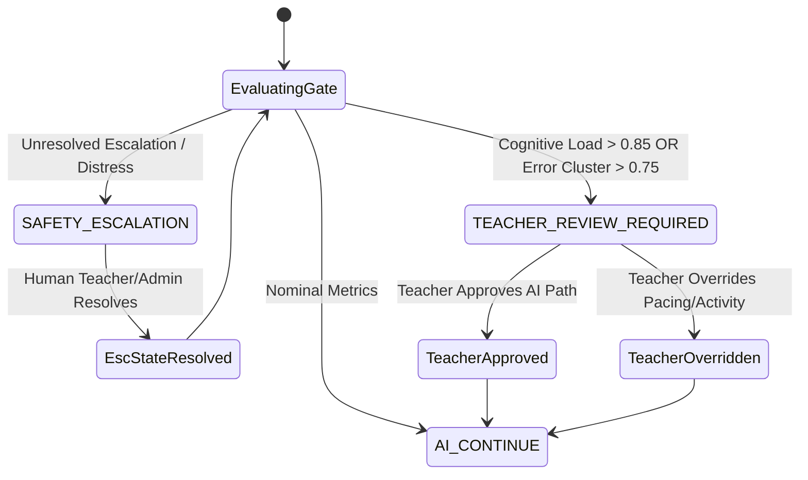
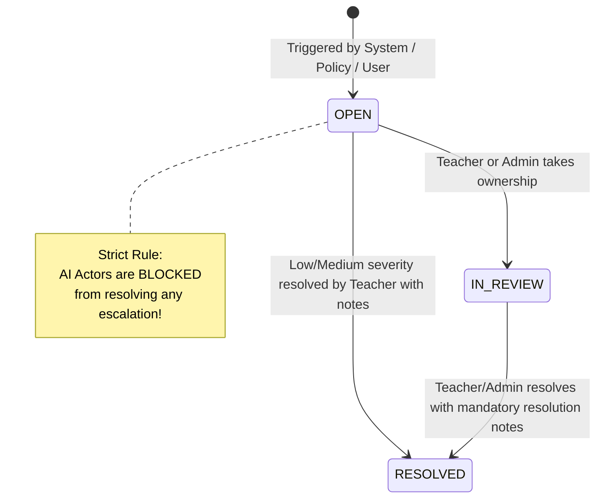

# Phase P1: Core Human–AI Learning Loop Architecture

## 1. Overview & Objective

The **Core Human–AI Learning Loop** establishes a closed-loop pedagogical and safety architecture where AI and human educators collaborate responsibly. The AI adapts pacing and exercises to student cognitive states, but critical boundaries ensure that AI recommendations never escape teacher oversight or certifiably graduate students without authoritative validation.

```
STUDENT
   │
   ▼
Learning Context (age/tier, grade, curriculum, mastery, recent evidence, active goals)
   │
   ▼
PERSONALIZATION DECISION (next activity, difficulty, modality, pacing, intervention recommendation)
   │
   ▼
AI LEARNING INTERACTION (boundary + handoff contract)
   │
   ▼
LEARNING EVIDENCE (answer, accuracy, attempt, hint usage, misconception, engagement)
   │
   ▼
MASTERY UPDATE (deterministic BKT + RL adjustment)
   │
   ▼
POLICY / SAFETY GATE (AI continue | teacher review required | safety escalation)
   │
   ▼
TEACHER (review, approve, override, intervene, provide feedback)
   │
   ▼
NEXT LEARNING DECISION
```

---

## 2. Core Invariants & Policy Boundaries

| Invariant | Specification & Enforcement Layer |
| :--- | :--- |
| **AI Cannot Certify Mastery** | Enforced by `PolicyEngineService.enforceMasteryCertificationRule` and `PersonalizationDecision.isCertifiedMastery = false`. Only formal teacher/exam assessments can certify mastery. |
| **Teacher Override Wins** | Enforced by `TeacherInterventionService.executeIntervention`. Any teacher override replaces AI activities, updates status to `OVERRIDDEN`, and logs a tamper-evident audit record. |
| **Safety Escalation Cannot Be Silently Dismissed by AI** | Enforced by `EscalationStateMachineService.transitionState`. Passing `ActorType.AI` or `ActorType.STUDENT` throws a `ForbiddenException`. Only `TEACHER` or `ADMIN` can review or resolve. |
| **Idempotent Evidence Ingestion** | Enforced by `EvidenceProcessorService.processEvidence` with `LearningEvidenceLog.idempotencyKey` unique constraints. Repeated requests return cached evaluation without duplicate mastery mutations. |
| **Teacher-Student Scoping Security** | Enforced by `TeacherInterventionService.verifyTeacherStudentScope`. Teachers can only access or intervene on students actively enrolled in their digital classrooms or assigned worksheets. |

---

## 3. Modular Monolith Architecture

The implementation lives in `backend/src/learning-loop/`:

```
backend/src/learning-loop/
├── domain/
│   ├── enums.ts           # GateState, ActivityType, Modality, Pacing, ActorType, EscalationStatus
│   └── types.ts           # StudentLearningContext, PolicyGateResult, AuditLogEntry
├── dto/
│   ├── submit-evidence.dto.ts
│   ├── personalization-request.dto.ts
│   ├── teacher-intervention.dto.ts
│   └── escalation-action.dto.ts
├── policy/
│   ├── policy-engine.service.ts
│   └── policy-engine.spec.ts
├── escalation/
│   ├── escalation-state-machine.service.ts
│   └── escalation-state-machine.spec.ts
├── evidence/
│   ├── evidence-processor.service.ts
│   └── evidence-processor.spec.ts
├── personalization/
│   ├── personalization-engine.service.ts
│   └── personalization-engine.spec.ts
├── intervention/
│   ├── teacher-intervention.service.ts
│   └── teacher-intervention.spec.ts
├── audit/
│   └── learning-loop-audit.service.ts
├── learning-loop.service.ts
├── learning-loop.controller.ts
├── learning-loop.module.ts
└── *.spec.ts
```

---

## 4. State Machines & Decision Flow

### 4.1 Policy Gate Transitions



### 4.2 Escalation State Machine



---

## 5. Database Schema Additions

The P1 layer adds 6 core relational models to PostgreSQL:
1. `LearningEvidenceLog`: Immutable evidence capture with unique `idempotencyKey`.
2. `PersonalizationDecision`: Machine-generated recommendations with `isCertifiedMastery: false`.
3. `PolicyGateDecision`: Guard decisions tracking evaluated rule details.
4. `TeacherIntervention`: Educator actions (APPROVE, OVERRIDE, INTERVENE) with feedback.
5. `EscalationEvent`: State-tracked safety and distress escalations.
6. `LearningLoopAuditLog`: Immutable audit trail for all human and machine actions.
