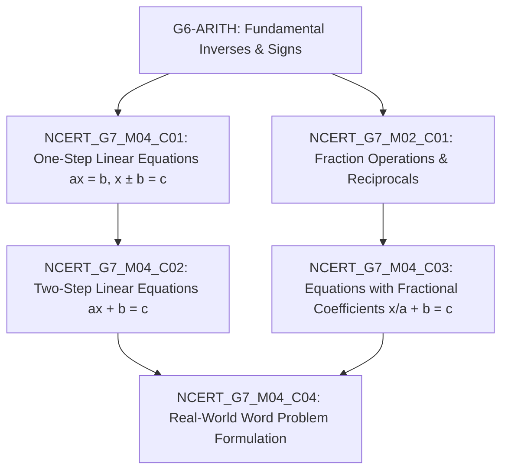

# YOUVA-EdAI — Strategy: Curriculum Scope & Concept DAG
## Canonical Strategy Document | Phase 0 Scope Lock

**Status:** RATIFIED & LOCKED  
**Curriculum Standard:** NCERT / CBSE Class 7 Mathematics  
**International Cross-Alignment:** Common Core State Standards (CCSS.MATH.CONTENT.7.EE & 7.RP)  
**Date Locked:** 2026-09-25  

---

## 1. Locked Curriculum Units

The MVP content scope is restricted exclusively to two chapters from the NCERT Class 7 syllabus:

1. **Chapter 4: Simple Equations** (Linear Equations in One Variable)
2. **Chapter 2: Fractions and Decimals** (Multiplication, Division, and Reciprocals)

---

## 2. Concept Prerequisite Dependency Graph (DAG)

---

## 3. Question Bank Sizing & Sourcing Matrix

| Concept Node ID | Concept Title | Target Items | Diagnostic Items | Sourcing Strategy |
|---|---|:---:|:---:|---|
| **NCERT_G7_M04_C01** | One-Step Linear Equations | 10 | 1 | NCERT Open Stems + Socratic In-House Hints |
| **NCERT_G7_M04_C02** | Two-Step Linear Equations | 10 | 1 | NCERT Open Stems + Socratic In-House Hints |
| **NCERT_G7_M04_C03** | Fractional Coefficients | 10 | 1 | NCERT Open Stems + Socratic In-House Hints |
| **NCERT_G7_M04_C04** | Word Problem Translation | 10 | 1 | NCERT Open Stems + Socratic In-House Hints |
| **NCERT_G7_M02_C01** | Fraction Reciprocals & Inverses | 10 | 1 | NCERT Open Stems + Socratic In-House Hints |
| **TOTAL** | **Grade 7 Math MVP Bank** | **50 Items** | **5 Items** | **100% Double-Blind Peer Reviewed** |

---

## 4. Content Review & Quality Assurance Gate

1. **Pedagogical Author:** 1 Middle School Math Educator authors 50 question items and hint DAGs.
2. **Double-Blind Reviewer:** A secondary Math Specialist independently solves every item, verifying:
   - Zero mathematical ambiguity.
   - Tier 1 hints guide conceptually without revealing procedural steps.
   - Misconception keys correctly intercept common arithmetic mistakes (e.g. sign reversal, premature division).
